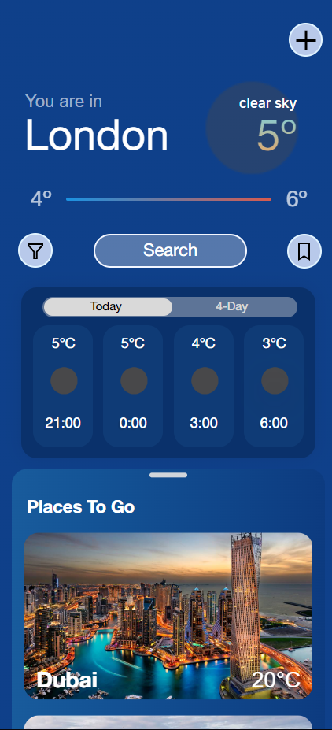
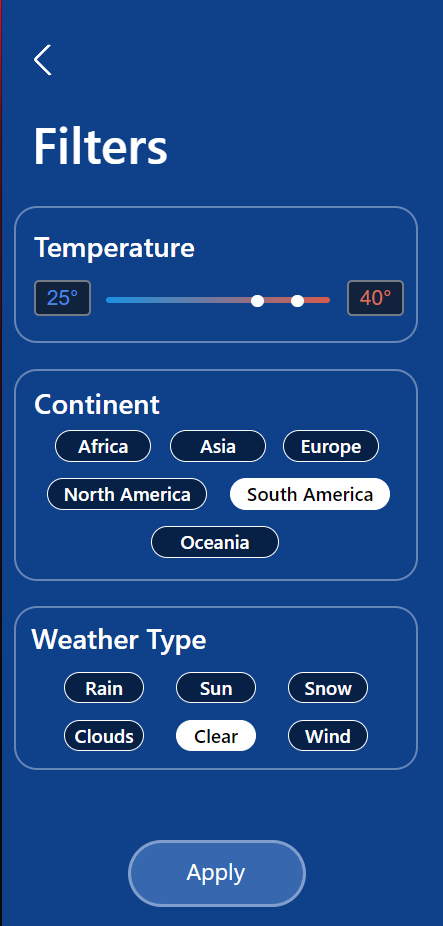
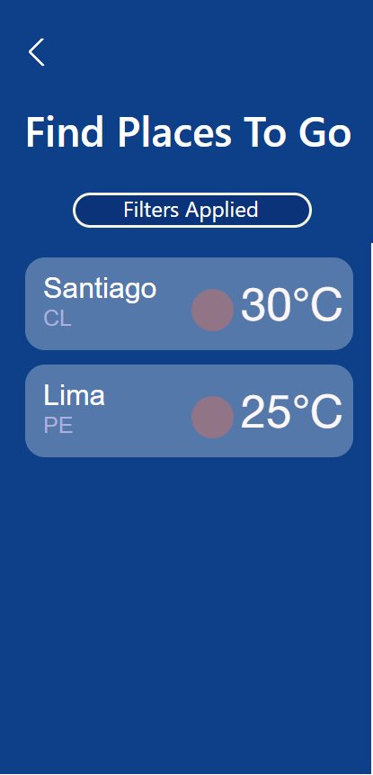
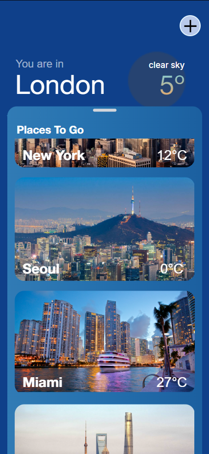
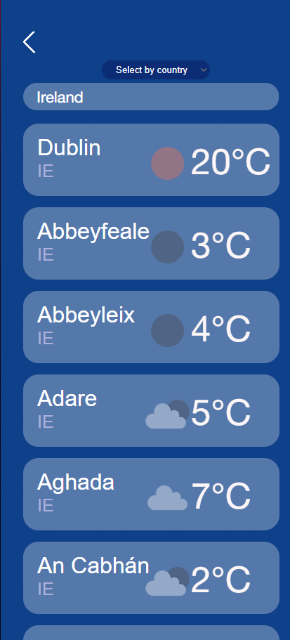

### 🌤️ Weather Tourism App

## ✨ Overview

Weather Tourism App is a real-time weather application designed with tourists in mind. Whether you're dreaming of a tropical beach getaway or a chilly mountain retreat, this app helps you discover destinations around the world that match your preferred weather conditions.
## 🔍 Key Features
# 🧭 Filter Destinations by Weather

Looking for sunny cities above 25°C? Or maybe you're in the mood for colder, snowy weather? Use the app’s filter functionality to find destinations that match your specific weather preferences.

# 🌍 Get Personalized Recommendations

Not sure where to go next? The app provides intelligent, weather-based travel recommendations to inspire your next holiday adventure.

# ❤️ Save Your Favorite Destinations

Found a place you love? Add it to your Favorites list to easily track and revisit cities or countries that match your ideal weather.

# 🔎 Search by City or Country

Looking for something specific? Use the powerful search feature to look up any city or country and instantly view its current weather conditions.

# 🌟 Why Use This App?

    ✅ Plan better trips with real-time weather insights

    ✅ Discover new travel destinations based on your weather preferences

    ✅ Stay inspired with tailored holiday recommendations

    ✅ Keep track of your favorite locations with ease
